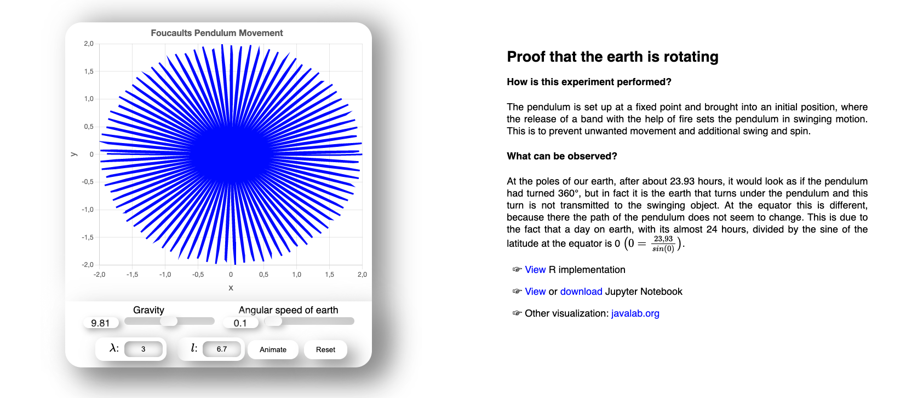

# [Foucault Pendulum Website](https://btschwertfeger.github.io/Foucaults-Pendulum-Website/)

The Foucault pendulum, named after its inventor, the French physicist [Léon Foucault](https://en.wikipedia.org/wiki/L%C3%A9on_Foucault), is a very long spherical pendulum with a large mass at the bottom. In an experiment with such a pendulum in 1851, Foucault was able to prove for the first time in a simple way that the earth rotates. Before that, one always had to rely on long observations of the night sky and calculations. With this experiment, it has been possible to make the earth's rotation accessible in a relatively simple way, even to people with little or no knowledge of physics.

## How is this experiment performed?

The pendulum is set up at a fixed point and brought into an initial position, where the release of a band with the help of fire sets the pendulum in swinging motion. This is to prevent unwanted movement and additional swing and spin.

## What can be observed?

At the poles of our earth, after about 23.93 hours, it would look as if the pendulum had turned 360°, but in fact it is the earth that turns under the pendulum and this turn is not transmitted to the swinging object. At the equator this is different, because there the path of the pendulum does not seem to change. This is due to the fact that a day on earth, with its almost 24 hours, divided by the sine of the latitude at
the equator is 0. $$0=\frac{23.99}{sin(0)}$$

## Availability

- [https://btschwertfeger.github.io/Foucaults-Pendulum-Website/](https://btschwertfeger.github.io/Foucaults-Pendulum-Website/)
<!-- - [https://www.awi.de/ ....](https://www.awi.de/fileadmin/user_upload/AWI/Forschung/Klimawissenschaft/Dynamik_des_Palaeoklimas/OrbitalTheoryOfIceAges/) -->

## References

- Gerrit Lohmann (2021), provided a R implementation of the equations of the pendulum

- <a target="_blank" href="https://www.kip.uni-heidelberg.de/image/f/oeffwiss/pendel/Foucault.pdf"> The Foucault Pendulum </a> - a Simplified Trajectory Analysis for a Pendulum on a Turntable and an Outlook to a Pendulum on Earth, A. Reiser annd J. Stiewe (2018)
- <a target="blank" href="https://github.com/singhmeet11/Foucalt-s-pendulum-a-simple-proof-that-earth-rotates">Foucalts pendulum a simple proof that earth rotates</a> GitHub repository by Parmeet Singh Chani (singhmeet11) (2022)
